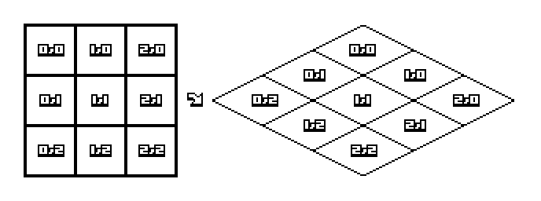

# Game Design Document (GDD)
# Little Empire

## Game design

Little empire is a strategy and settlement-building game that challenges players to adapt, trade, and thrive in a dynamically generated world. The game is built in C++ with a custom core using SFML library

The world is seen through isometric (more precisely dimetric) view. The game takes place on a map grid which is projected onto the screen as seen in the picture below:

The player starts in one randomly selected region and must explore other regions hidden by the fog of war. Each region contains random resources the player should utilize expand their empire and make it's inhabitants happy

## Core mechanics

1. Exploration and settling
- The player starts in a random region which they must settle, on a randomly generated map
- Each area is unique with different resources and the player must adapt
- The player must use resources and part of the population to settle other regions
- Explore 4 unique biomes - Grassland, Desert, Tundra, Rocky steppe

2. Building and managing
- Expand your empire by constructing buildings for housing, production and infrastructure 
- Make production chains to produce more advanced resources
- Manage workers, citizen loyalty, resources and upkeep
- Upgrade citizen class by making them happy and providing products

3. Expansion and trading
- Set up trade routes with NPC traders
- Exchange goods for needed resources to adapt 
- Expand to new territories by spending resources and population to settle
- Upgrade citizen classes and grow your empire

## Gameplay description

- At the start the player will have 2 visible regions. They can either settle one of them or explore more.
- When they settle a worker camp with temporary housing will be created.
- After some time the player will need to build houses for their citizens. Houses can be built with either wood, stone or bricks depending on the available resources. Homeless citizens will decrease the regions happiness
- To construct buildings, the lower level citizens without a job need to be assigned as builders
- Citizens require their basic needs like food and water and they also have bonus needs
- To get water the player must settle near a river or built a well on an underground stream
- The basic food includes berries, meat, fish, fruits and vegetables
- The player must gather and produce advanced resources, like clothes, to upgrade the citizens class
- Many buildings require workers of a certain class, so the player needs to balance the workforce
- To upgrade citizen's class their basic and bonus needs must be fullfilled.
- Upgrading citizen's class costs resources to upgrade their house and money
- To gain more population the needs of citizens must be satisfied and the region happiness must be high so they reproduce
- Another way to get new population is by having high happiness and reputation so other people move in to the region
- Progress through the game and unlock advanced features like policies and scholars

## Cards

- Sólo (5)
- Hra v C/C++/Rust (15)
- 2.5D grafika (15)
- Přehrávání samplů/hudby (5)
- Ukládání/načítání (5)
- Procedurální generování (15)
- Válečná mlha (5)
- Politická mapa (5)

