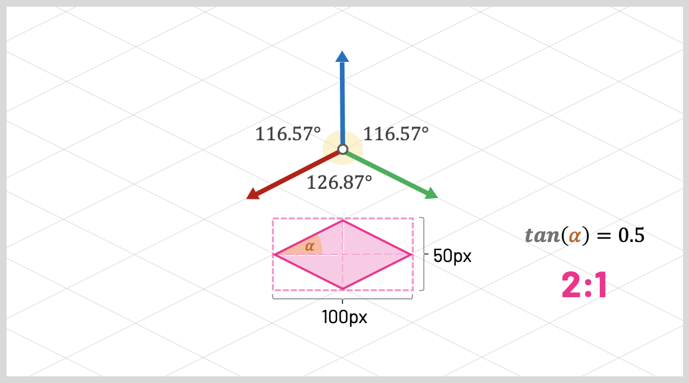
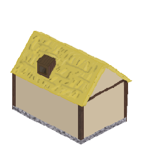
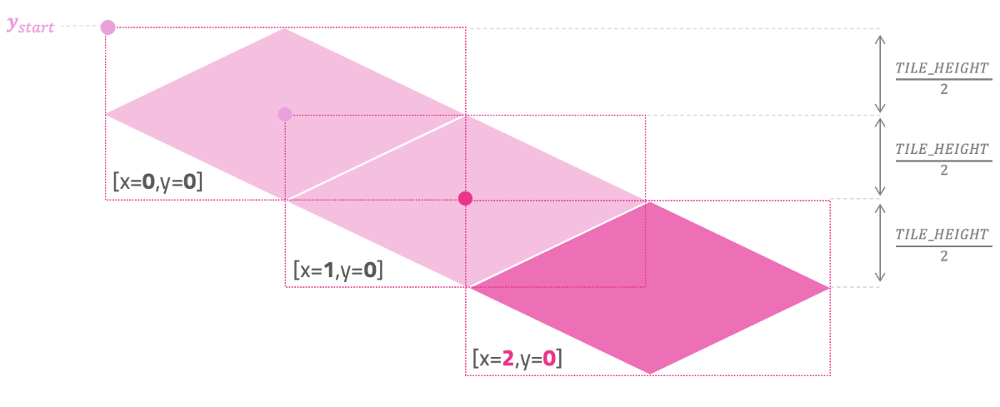

# Závěrečná zpráva

### Dominik Štoček

## Základy (Hra v C++)

Jelikož vytvářím vše v C++ pomocí knihovny SFML, se kterým jsem nebyl do hloubky seznámen, bylo potřeba jít od základů
Pomocí tutoriálů na oficiální stránce jsem vytvořil hlavní smyčku, zpracoval eventy a vytvořil okno a zobrazoval do něj.

> https://www.sfml-dev.org/documentation/2.6.2/

Tato základní smyčka ovšem nepracuje s časem. Navíc běží stále dokola a je nedeterministická. To je pro něktéré systémy (fyzika, simulace, kolize) nežádoucí.
Našel jsem tento pěkný článek, který se tímto zabívá: https://gameprogrammingpatterns.com/game-loop.html

Vytvořil jsem tedy druhou smyčku, která proběhne pouze N krát za sekundu. Zatím jsem zvolil 128 ticků kvůli jednoduchosti hry, ale v praxi je lepší použit kolem 64 ticků.
Čas byl měřen pomocí SFML:
> https://www.sfml-dev.org/tutorials/2.6/system-time.php

Pro přidání dalších funcionalit, jako zobrazení více entit, jejich ukládání a zpracování vstupů bylo potřeba vytvořit třídy, které se o tyto věci budou starat, aby nevznikly v hlavní smyčce špagety a abychom měli kvalitní enkapsulaci.

Pro představu jaké systémy budou potřeba a co by měli obsahovat jsem se inspiroval komunitním enginem:
> https://github.com/TheCherno/Hazel/tree/master/Hazel/src/Hazel

Pro ukládání entit sloužila *Scene* a k renderování třida *Renderer*. Dále jsem také vytvořil *InputSystém*.
Tento systém je poměrně složitější, než se zdá. Chtěl jsem vytvořit robustnější systém, než jen systém, který reaguje na *raw eventy*.
Zpracování vstupů probíhá takto: 
1. Každý kontroller si drží svůj aktuální kontext
2. Systém do kontrollerů pošle input, který se pomocí kontextu mapuje na herní akci
3. Kontroller si drží funkci (callback) pro danou akci, který bude zavolán

Dále si také kontrollery udržují seznam držených kláves a reagují na držení. Tento systém je velmi flexibilní a umožňuje provádět různé akce pro stejnou klávesu, nebo různé klávesy zakazovat podle toho co se ve hře děje
Velkou inspirací tohoto systému byl Unreal Engine:

> https://dev.epicgames.com/documentation/en-us/unreal-engine/enhanced-input-in-unreal-engine
> https://dev.epicgames.com/documentation/en-us/unreal-engine/setting-up-user-inputs-in-unreal-engine

Aby byly systémy pohromadě a použitelné na více místech jsou ukládány do třídy *GameContext*. Finální herní smyčka vypadá takto:

```
   while( window.isOpen() )
   {
      auto frameTime = clock.restart().asSeconds();
      accumulator += frameTime;

      sf::Event event;
      while( window.pollEvent( event ) )
      {
         if( event.type == sf::Event::Closed )
            window.close();

         context->inputSystem->handleInput( event );
      }

      while( accumulator >= FIXED_DT )
      {
         updateSystems( FIXED_DT );
         accumulator -= FIXED_DT;
      }

      context->inputSystem->update( frameTime );
      context->scene->update( frameTime );
      window.clear();
      context->scene->renderScene( window, *renderer );
      window.display();
   }
```

## UI

Tato část se ukázala jako lehce problémová. Jelikož je umožněno hýbat s kamerou, což hýbe i s entitami světa, je potřeba aby UI zůstalo statické. Toto se úkazalo jako zajímavý problém, který jsem zpočátko nevěděl jak jednodušše vyřešit. V hlavní smyčce je jedno okno, do kterého se vše renderuje. Je zde tedy problém, že s pohybem kamery be se výbalo i UI.

Nakonec jsem narazil na tento tutoriál přímo od SFML. Ten ukazuje jak lze použít *view* k vyrenderování druhé "scény". Po vykreslení scény stačí tedy stačí přepnout view, do kterého se vykreslí UI a následně vrátit zpět originální *view*, se kterým může kamera hýbat.

> https://www.sfml-dev.org/tutorials/3.0/graphics/view/#defining-how-the-view-is-viewed 

## 2.5D Grafika

Podstata tohoto stylu vykreslování spočívá ve vytvoření iluze 3D pomocí 2D *spritů*. Objekty jsou zobrazovány v rovině, ale jsou vytvořeny (nakresleny) pomocí pevně dané projekce (nejčastěji isometrické), aby působyly prostorově. Kamera není perspektivní, ale využívá rovnoběžné promítání, díky čemuž si objekty zachovávají stejnou velikost bez ohledu na vzdálenost od kamery.

Toto téma pro mě bylo trochu problematické, hlavně kvůli potřebě LA2 pro lineární zobrazení. Jelikož čtvercová mřížka se v tomto stylu jinak zobrazuje na obrazovky bylo potřeba provádět několik matematických operací pro správné indexování políček a zobrazení spritů.

Nejprve jsem potřeboval pochopit jak vůbec zobrazení funguje, abych mohl kreslit správné sprity.

K tomu sloužil tento pěkně zpracovaný článek, který celou projekci do detailů popisuje: https://pikuma.com/blog/isometric-projection-in-games
Ten ukazuje, že v izometrické projekci se čtverec mění na diamant s poměrem stran 2:1. Stačí tedy z pivotního bodu pomocí čtverců s poměry stran 2:1 nakreslit čáry reprezentující osu X a Y a podle nich dokreslit zbytek.
Na tomto obrázku je vidět jak takový diamant vypadá a jak ho lze nakreslit:


Výsledný sprite vypadá takto: 



Vykreslování mapy již bylo jednoduché. Jelikož políčka jsou kreslena již v izometrickém zobrazení, stačí pouze z indexu 2D mřížky zjistit, kde bude pivotní bod políčka na obrazovce, jak je vidět na následujícím obtázku:


Toho lze docílit těmito rovnicemi:

`x = xstart + x * (TILE_WIDTH/2) - y * (TILE_WIDTH/2)`

`y = ystart + x * (TILE_WIDTH/2) + y * (TILE_WIDTH/2)`

Problém nastane, pokud potřebujeme převést souřadnice obrazovky zpět do čtvercové mřížky pro zjištění indexu a naopak. Zde se již be zobrazení nedá obejít a v kódu bylo následně potřeba převádět mezi souřadnicemi mapy (mřížky) a souřadnicemi obrazovky. K tomu jsem použil rovnice z předchozího článeku a vytvořil funkce pro převod (zobrazení):
```
   inline sf::Vector2f screenToWorldSpace( const sf::Vector2f& screenCoords )
   {
      return sf::Vector2f{ ( screenCoords.x + 2 * screenCoords.y ) / 4, ( 2 * screenCoords.y - screenCoords.x ) / 4 };
   }

   inline sf::Vector2f worldToScreenSpace( const sf::Vector2f& worldCoords )
   {
      return sf::Vector2f{ 2 * worldCoords.x - 2 * worldCoords.y, worldCoords.x + worldCoords.y };
   }
```

Aby se políčka a sprity vykreslovala zprávně v Malířském algoritmu, bylo je jěště potřeba seřadit. K tomu stačilo použít souřadnici Y.
V plánu bylo jěště přidat entity, které se mohou pohybovat a nejsou organizované do mřížky (mohou být na okraji dvou políček). Zde jsem měl v plánu použít AABB tak, že sprity, které se překrývají by použily svůj bounding box (podstava spritu) zobrazený do čtvercové mřížky pro rozhodnutí kdo je víc vzadu.

Kvůli nedostatku času ale nedošlo k implementaci :-(.
Základní myšlenka je z tohoto článku: 

> https://mazebert.com/forum/news/isometric-depth-sorting--id775/

Autor ovšem použivá TopSort, což mi nepřišlo efektivní. V mém návrhu by byly pohybující se entity ve vlastním kontejneru, kde by docházelo k řazení pomocí souřadnice Y a bounding boxu a poté by se slévaly s již seřazenýmy statickými entitami. Jak by vypadal bounding box entit je vidět v následujícím postu: 

> https://www.reddit.com/r/gamemaker/comments/qz9iue/just_collidingdepth_sorting_with_an_isometric/

## ECS

Jak se hra a engine rozrůstaly, začaly se projevovat některé nedostatky. V první verzi mezi sebou jednotlivé entity dědily a musela scéna dělit entity na *movable* a *static*. Některé entity, např. budova, která není postavena, ale hráč s ní může hýbat, se ovšem mohou hýbat a zároveň musí být vykresely přes všechny entita světa (*overlay* entity). Po postavení je tedy potřeba tuto budovu změnit na normální sprite scény, který je řazen podle hloubky.

Scéna je nyní *bloated* a udržuje si již 3 vektory entit. Navíc kvůli pevné hierarchii entit není možné změnit chování entity za běhu. To je patrné v kontrolleru, kdy potřebujeme *overlay* entitu pro nepostavenou budovu a následně ji po postavení změnit. To vede na nepřehledný kód, kdy entita nejprve musí být odstraněna ze scény, následně se změní kategorie (enum) té samé entity na kterou máme stále pointer a poté se přidá do scény jako pevná entita.

Toto je jeden z několika problémů předchozí architektury. Díky ECS jsou tyto problémy triviální a kód se mnohonásobně zpřehlední. Změna chování spritu entita představuje nyní 2 řádky
```
   context_->scene->removeComponent<OverlaySpriteComponent>( building->getEntityId() );
   context_->scene->addComponent<SpriteComponent>( building->getEntityId(), ..., SpriteMobility::STATIC,... );
``` 

Pro implementaci jsem čerpal z tohoto zdroje:

> https://austinmorlan.com/posts/entity_component_system/

Základem je kontejner pro komponenty. Ten je implementován jako *packed array*. Všechny komponenty jsou v paměti za sebou a po odstranění komponenty nevznikají díry. Pro rychlé hledání jsou použity mapy z entity do indexu a z indexu do entity

```
   std::vector<TC> components;
   std::unordered_map<Entity, size_t> entityToIndex;
   std::unordered_map<size_t, Entity> indexToEntity;
```

Následně jednotlivé systémy registrují typy svých komponent v registru, čímž se pro ně vytvoří předchozí kontejner. Identifikátory entit spravuje třída *EntityManager* a společně s registrem komponent jsou uloženy ve scéně.

V mé implementace jsem udělal kompromis a oproti čístému ECS jsem přidal třídu *FunctionalEntity*, která reprezentuje entity, která není jen čisté ID. Tyto entity mají speciální kontejner ve scéně a je jim umožněno mít naprogramované chování, pro které není nutné vytvářet komponentu, nebo systém. Například entita *StoneMiner* má v sobě zabudované chování pro těžení suroviny. Entita, ze které je surovina těžena má její počet a metody pro vytěžení. Pokud by byly vytvářeny systémy a komponenty pro každé unikátní chování entity, došlo by rychle ke *code bloat*. Díky tomuto kompromisu máme čistou ECS architekturu a počet systémů a komponenta se pohybuje v udržitelné hranici.

## Procedurální generování a celulární automaty

Pro strategické hry je potřeba mít zajímavý terém, který je pro každou hru jiný. Pro generování terénu existuje řada metod, které se dají kombinovat. Pro základní vytvoření terénu jsem se rozhodl použít celulární automaty. 

Pro realističtější terén jsem nejprve použil binary space partitioning pro vytvoření oblastní pro kontinenty, aby se nemohli překrývat.

> https://medium.com/@guribemontero/dungeon-generation-using-binary-space-trees-47d4a668e2d0

Poté jsem vygeneroval náhodné body podle těchto pravidel:
- Pokud je bod ve vzdálenosti 1 od hranice je typu Voda
- Pokud je bod ve vzdálenosti 2-4 od hranice je šance 30 %, že bude Pevnina
- Pro zbytek bodů je šance 52 % pro Pevninu

Následně jsou bodu jednotlivých oblastí zpracovány celulárním automatem. Pomocí jednoduchých pravidel lze následně vytvořit přesvědčivé kontinenty:

- Pokud má Pevnina více než 5 sousedů typu Voda, změní se na Vodu
- Pokud má Voda více než 4 sousedy typu Pevnina, změní se na Pevninu.

Následně lze pro pevninu použít masku nějakého šumu pro vygenerování výškové mapy. Kvůli nedostatku času jsem toto bohužel nestihl.

> https://natureofcode.com/cellular-automata/

## Procedurální generování a politická mapa

Má hra má fungovat na bázi regionů, kde hráč postupně zabírá více regionů a mimo svůj region nemůže stavět. Jejich kvalitní a spravedlivé generování je ovšem složitější než se zdá a celkově zabralo 2 krát více řádků, než generování mapy.

Nejprve jsou pomocí algoritmu BFS identifikovány kontinenty a ostrovy (souvislé komponenty). Strategie pro komponenty menší než daná velikost je jejich smazání. Následně je potřeba určit body, kde region začne (seed points). Při pokusu body generovat náhodně byly některé body příliš u sebe a některé regiony vypadaly velmi podivně.

To jsem opravil jednoduchou implementací Poisson Disk Sampling:

```
   std::vector<int> samples;
   samples.reserve( amount );
   std::ranges::shuffle( blob, rng );

   for( int i = 0; i < blob.size() && samples.size() <= amount; ++i )
   {
      bool tooClose = false;
      int x = blob[ i ] / width;
      int y = blob[ i ] % width;

      for( const auto& sample: samples )
      {
         int sampleX = sample / width;
         int sampleY = sample % width;

         if( std::hypot( x - sampleX, y - sampleY ) <= minSeedDistance )
         {
            tooClose = true;
            break;
         }
      }

      if( !tooClose )
         samples.push_back( blob[ i ] );
   }

   return samples;
```

Následně stačilo spustit BFS/flood fill z vybraných bodů a po dokončení jěště spojit regiony s přilíš malou velikostí s nejmenším sousedem.
